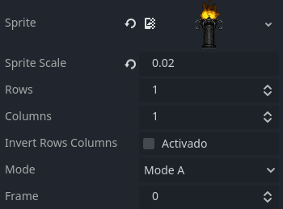
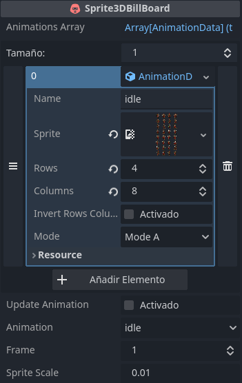
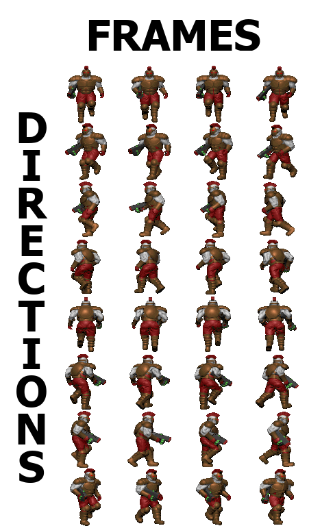
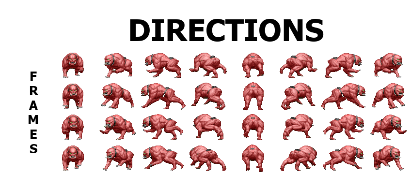

# Sprite3DPlus for Godot

this add-on adds two new nodes, the Sprite3DBillBoard node and the SimpleSprite3DBillBoard node, the two nodes will be explained in detail below:

## SimpleSprite3DBillBoard

It is the simplest version of the Sprite3DBillboard node, as its name indicates it, this node works like the Sprite3D node, but adapted so that you show in a billboard of 8 directions, like in the game doom.

This node has the following properties:

1. **Sprite:** this property stores the texture of the sprite sheet.

2. **Sprite Scale:** this property modifies the scale of the mesh with respect to the sprite.

3. **Rows and Columns:** it is the amount of rows and columns that compose the sprite sheet.

4. **Invert row columns:** it is a boolean that modifies the reading of the sprite sheet.

5. **Mode:** this property changes the rendering mode, there are two rendering modes.

6. **Frame:** modifies the frame of the sprite animation.

## Sprite3DBillBoard

This node is similar to its simple version, with the difference that it supports multiple sprite sheets (known as "animation data") in an array.

The properties are shown below:

1. **Animations Array:** it is the array that contains all the animations for sprites, this is stored through the resource called AnimationData.
2. **Update Animation:** this boolean works as a button to update the animations in the interface.
3. **Animation:** this enum is used to switch between animations in the Animations Array.
4. **Frame and Sprite Scale:** it works similar to its simple version.

## Sprite Sheet Recommendation

It is recommended that the sprite sheets follow the following layout:

1. if invert_rows_columns is **false**

2. if invert_rows_columns is **true**

## Acknowledgments

thank you very much to all those who will be mentioned below:

1. kyra for [2.5d sprite shader](https://godotshaders.com/shader/2-5d-sprite-shader/).

2. u/dron1885 for [Shader only 8 directional billboarding.](https://www.reddit.com/r/godot/comments/13fgdek/shader_only_8_directional_billboarding/)

3. Nmn for [Monster Mutant Leader for FPS Game](https://opengameart.org/content/monster-mutant-leader-for-fps-game), [Monster mutant for FPS game](https://opengameart.org/content/monster-mutant-for-fps-game), [Human guard for Sprite Based FPS](https://opengameart.org/content/human-guard-for-sprite-based-fps).

4. Proxy Games for [Grass Texture Pack](https://opengameart.org/content/grass-texture-pack)